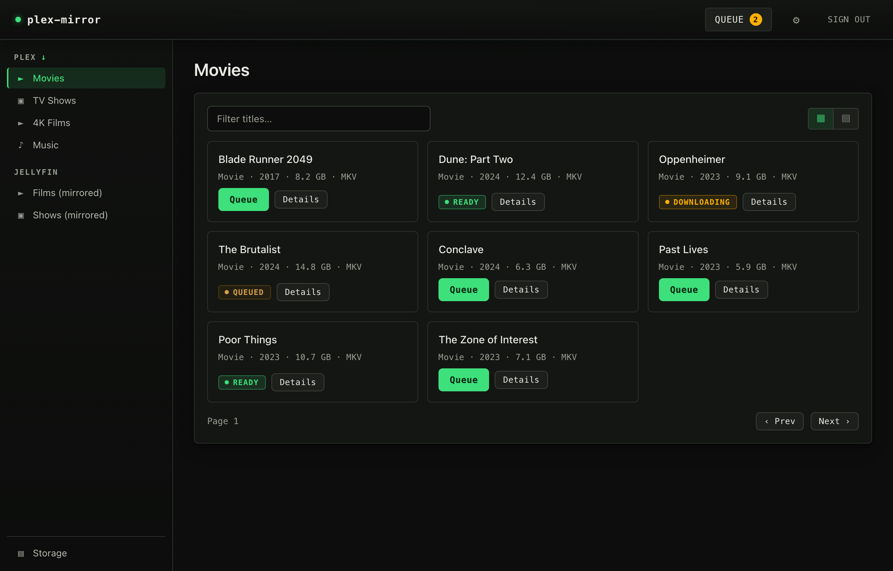
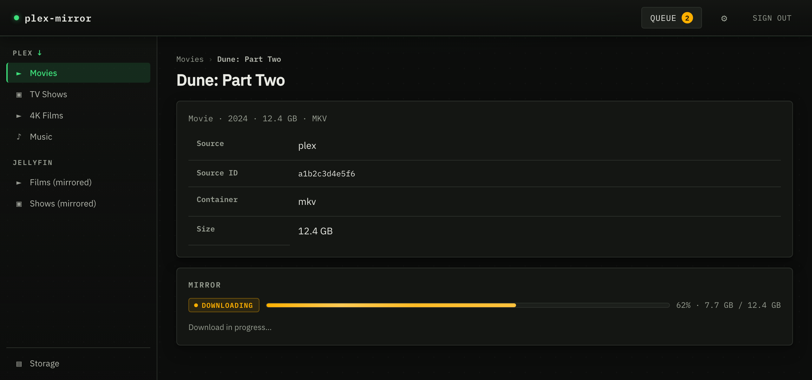
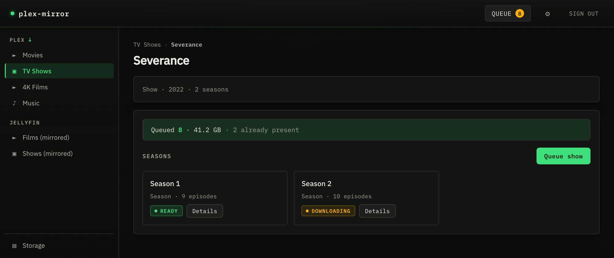
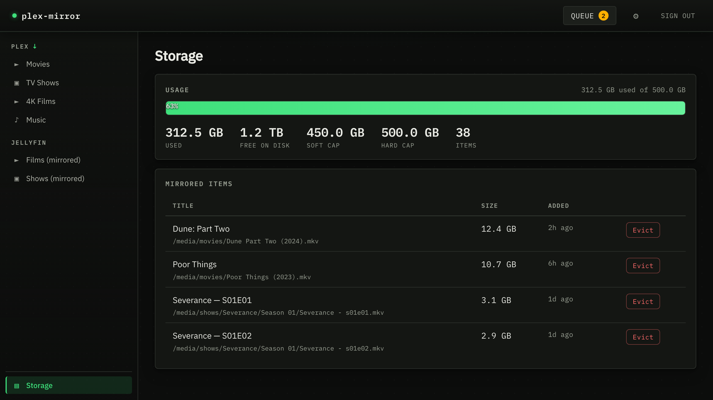
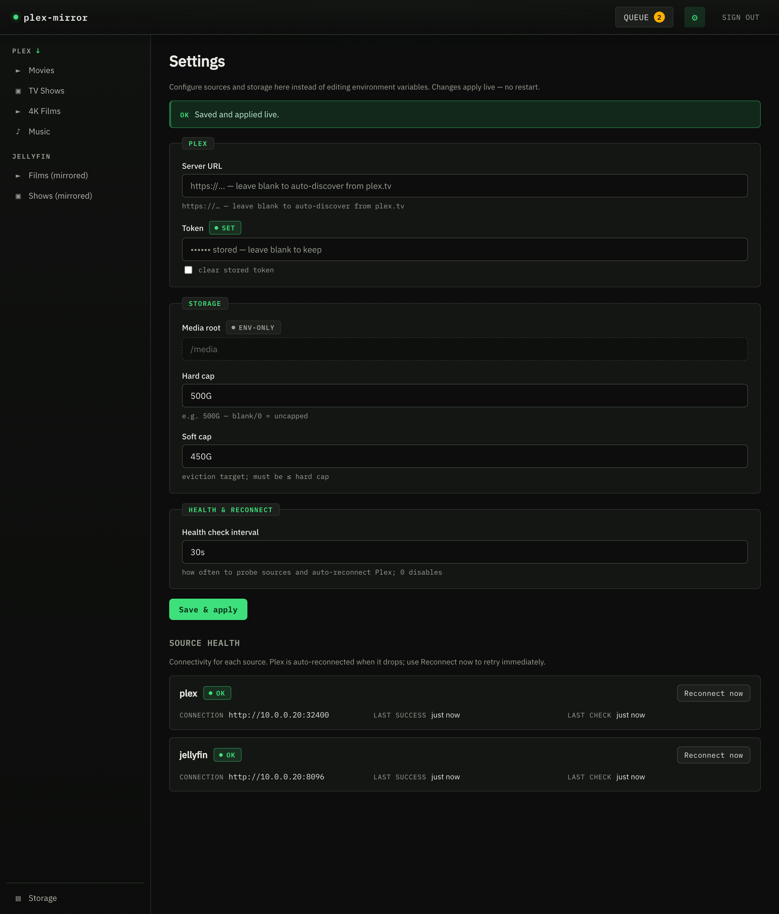

# plex-mirror

A single Go binary that pulls a curated subset of a remote (shared) Plex server
onto local disk, laid out for a co-located Jellyfin instance to serve. It runs
as a long-lived service with two faces over one core: a browser portal and an
MCP server. The same binary is also a CLI and its own Docker healthcheck probe.

Built for a homelab / single-tenant setup behind Traefik.



<sub>Screenshots use sample data, not a real library.</sub>

| | |
|---|---|
|  |  |
|  |  |

## What it does

A shared Plex server is great for watching but awful for keeping things: the
owner can remove media at any time, and you can't run your own automation
against it. plex-mirror lets you browse the share, queue the items you care
about, and download them to local storage where Jellyfin indexes and serves
them. Downloads are resumable, the mirror is size-capped with automatic
eviction, and Plex connections self-heal when the remote server moves.

- **Browse** any configured Plex/Jellyfin library from the portal or over MCP.
- **Queue** a single item, a season, or a whole show. Bulk queues skip what's
  already mirrored.
- **Download** over HTTP `Range` with resume, integrity checks, and
  backoff-with-jitter retries. Files land in a Jellyfin-friendly layout
  (`movies/Title (Year).ext`, `shows/Show/Season NN/...`) via an atomic rename,
  so Jellyfin never sees a partial file.
- **Cap** local usage with soft/hard byte limits; a background sweeper evicts
  oldest-first to stay under cap.
- **Self-heal**: Plex is a remote server you don't control, so a background
  monitor probes it, re-discovers a working connection when it drops, and swaps
  it in live — no restart, no manual URL fixups.
- **Configure live**: source credentials, storage caps, and download tunables
  are editable from the Settings page and apply without a restart.

## How it works

Both faces are thin adapters over `internal/service`; no business logic lives
in the transport layers.

- **Portal** (`internal/server`) — cookie-authed browser UI built with
  [templ](https://templ.guide) + [HTMX](https://htmx.org), served as fragments.
- **MCP** (`internal/mcp`) — streamable HTTP at `/mcp`, bearer-authed. Each tool
  is a one-line call into the service.
- **Sources** (`internal/source`) — Plex implements browse + download; Jellyfin
  is mirror inventory plus a post-import rescan trigger. Backend types never
  cross the package boundary.
- **State** — a pure-Go SQLite DB (`modernc.org/sqlite`, so the binary is
  CGO-free and static). The `items` table is the single source of truth for each
  mirror's lifecycle (`queued → downloading → ready → evicted`), so the engine
  survives restarts.

More detail in [CLAUDE.md](CLAUDE.md) and [docs/adr/0001-library-picks.md](docs/adr/0001-library-picks.md).

## Quick start

### Docker (recommended)

Compose reads a sibling `.env` for secrets (gitignored). At minimum, point it at
your Plex share:

```bash
cat > .env <<'EOF'
PLEXMIRROR_PLEX_SERVER=Name Of The Shared Server
PLEXMIRROR_PLEX_TOKEN=your-plex-account-token
PLEXMIRROR_JELLYFIN_URL=http://jellyfin:8096
PLEXMIRROR_JELLYFIN_TOKEN=your-jellyfin-api-key
PLEXMIRROR_STORAGE_SOFT_CAP=450G
PLEXMIRROR_STORAGE_HARD_CAP=500G
MEDIA_HOST_PATH=/srv/media
EOF

docker compose up --build
```

The portal is on `:8080` (the compose file wires up Traefik labels for
`plex-mirror.local`). Mount the same `/media` volume Jellyfin reads from.

### Local

```bash
go build ./...
PLEXMIRROR_MEDIA_ROOT=./media \
PLEXMIRROR_PLEX_SERVER="..." PLEXMIRROR_PLEX_TOKEN="..." \
go run ./cmd/plex-mirror
```

## Configuration

Everything is set with `PLEXMIRROR_*` environment variables. Most can also be
changed live from the **Settings** page, which persists overrides in the DB and
layers them over the env values. `MEDIA_ROOT`, `AUTH_TOKEN`, and `SECRET_KEY`
are env-only.

Sizes accept `K`/`M`/`G`/`T` suffixes (1024-based). Durations use Go syntax
(`30s`, `5m`). Missing source credentials are non-fatal — the service boots
browse-only and the download engine stays disabled until Plex is configured.

| Variable | Default | Notes |
|---|---|---|
| `PLEXMIRROR_HTTP_ADDR` | `:8080` | listen address |
| `PLEXMIRROR_MEDIA_ROOT` | `/media` | mirror root; env-only |
| `PLEXMIRROR_DB_PATH` | `/var/lib/plex-mirror/state.db` | SQLite state |
| `PLEXMIRROR_LOG_LEVEL` | `info` | `debug`/`info`/`warn`/`error` |
| `PLEXMIRROR_PLEX_SERVER` | — | server name for plex.tv discovery |
| `PLEXMIRROR_PLEX_TOKEN` | — | account token (discovery) or per-resource token (explicit URL) |
| `PLEXMIRROR_PLEX_URL` | — | explicit server URL; wins over discovery |
| `PLEXMIRROR_PLEX_CLIENT_ID` | `plex-mirror` | `X-Plex-Client-Identifier` |
| `PLEXMIRROR_JELLYFIN_URL` | — | for the post-import rescan trigger |
| `PLEXMIRROR_JELLYFIN_TOKEN` | — | Jellyfin API key |
| `PLEXMIRROR_JELLYFIN_USER` | — | user id/name (only if the key is a server key with >1 user) |
| `PLEXMIRROR_MOVIES_DIR` | `movies` | subfolder under media root |
| `PLEXMIRROR_SHOWS_DIR` | `shows` | subfolder; e.g. `tv` to match Jellyfin |
| `PLEXMIRROR_OTHER_DIR` | `other` | subfolder |
| `PLEXMIRROR_STORAGE_SOFT_CAP` | `0` | eviction target; `0` = uncapped |
| `PLEXMIRROR_STORAGE_HARD_CAP` | `0` | ceiling; must be ≥ soft cap |
| `PLEXMIRROR_STORAGE_SWEEP_EVERY` | `5m` | eviction pass interval; `0` disables |
| `PLEXMIRROR_DOWNLOAD_CONCURRENCY` | `2` | simultaneous downloads, 1–32 |
| `PLEXMIRROR_DOWNLOAD_POLL_EVERY` | `10s` | queue scan interval |
| `PLEXMIRROR_DOWNLOAD_BUFFER` | `1M` | per-stream copy buffer (max 256M) |
| `PLEXMIRROR_HEALTH_CHECK_EVERY` | `30s` | source probe + Plex auto-reconnect; `0` disables |
| `PLEXMIRROR_AUTH_TOKEN` | — | portal cookie + `/mcp` bearer; empty = no app auth; env-only |
| `PLEXMIRROR_SECRET_KEY` | — | encrypts DB-stored source tokens (AES-256-GCM); empty = plaintext; env-only |

### Auth

`PLEXMIRROR_AUTH_TOKEN` gates the portal (cookie) and `/mcp` (bearer), both
constant-time compared. Empty means no app-level auth — intended for
deployments with Traefik forward-auth in front. `/healthz` and `/static` are
always open.

## CLI

The binary doubles as a CLI. Subcommands are positional; anything starting with
`-` is treated as server-mode flags instead.

```bash
plex-mirror dump --source=plex                 # list libraries (JSON)
plex-mirror dump --source=plex --library=ID    # list items in a library
plex-mirror download --source=plex --item=KEY  # one-shot, resumable download
plex-mirror evict-now [--dry-run]              # force an eviction pass
plex-mirror -healthcheck                       # probe local /healthz (Docker)
```

## MCP

`/mcp` exposes the same capabilities as the portal as MCP tools, for driving the
mirror from an agent:

`list_sources`, `list_libraries`, `list_items`, `get_item`, `list_children`,
`queue_download`, `queue_container`, `download_status`, `list_mirrored`,
`storage_stats`, `evict`, `get_config`, `source_health`, `reconnect_source`.

Stored secrets are never returned — `get_config` reports only whether each
credential is set.

## Plex token note

A **shared** Plex server returns 401 for your plex.tv account token on direct
API calls. Two ways to authenticate:

- **Discovery** (recommended): set `PLEXMIRROR_PLEX_SERVER` to the server's name
  and `PLEXMIRROR_PLEX_TOKEN` to your **account** token. The service resolves the
  server's connection URL *and* its per-resource access token from plex.tv at
  boot, so you never hardcode a volatile `*.plex.direct` URL.
- **Explicit**: set `PLEXMIRROR_PLEX_URL` and a `PLEXMIRROR_PLEX_TOKEN` that is
  the **per-resource** access token for that specific server.

`plex_token.py` / `probe_plex.py` (repo root) obtain and verify the right token.

## Development

```bash
go build ./...        # build
go vet ./...          # vet (CI runs this)
go test ./...         # tests
```

CI runs `go build` + `go vet` + `go test` on Go 1.25.

The portal views are templ files (`internal/server/views/*.templ`) compiled to
committed `*_templ.go`. After editing a `.templ` file, regenerate:

```bash
go run github.com/a-h/templ/cmd/templ generate
```

## License

Copyright © 2026 Max Dubrinsky. Licensed under the **GNU Affero General Public
License v3.0** — see [LICENSE](LICENSE). If you run a modified version as a
network service, AGPL requires you to offer its source to users.

Bundled third-party assets keep their own licenses: the [IBM Plex](https://github.com/IBM/plex)
fonts under the SIL Open Font License 1.1
(`internal/server/static/fonts/OFL.txt`) and [htmx](https://htmx.org) under its
BSD license.
